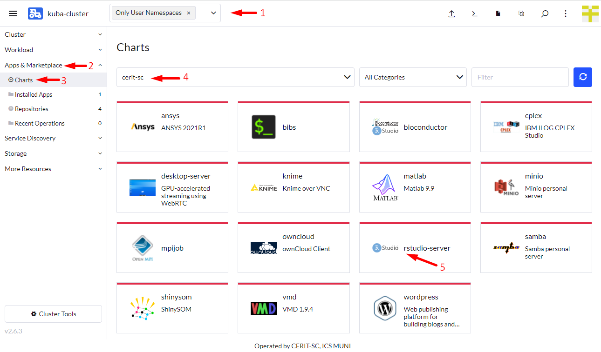
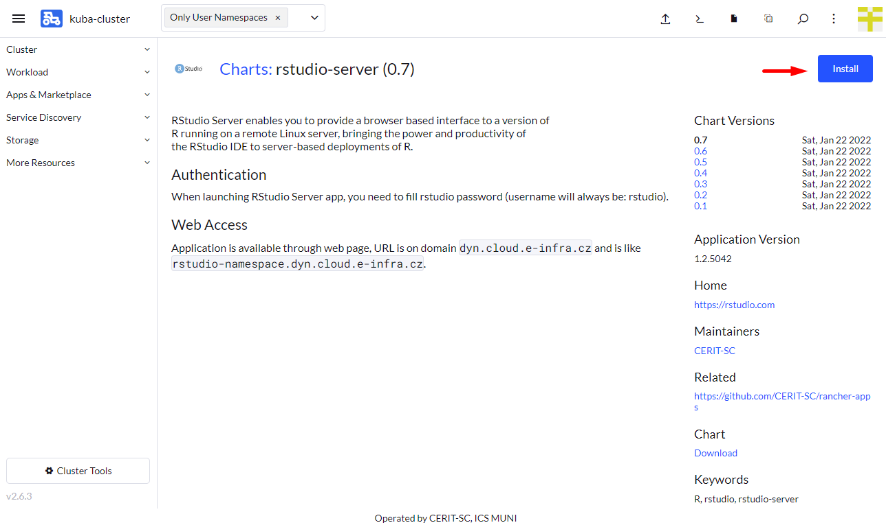
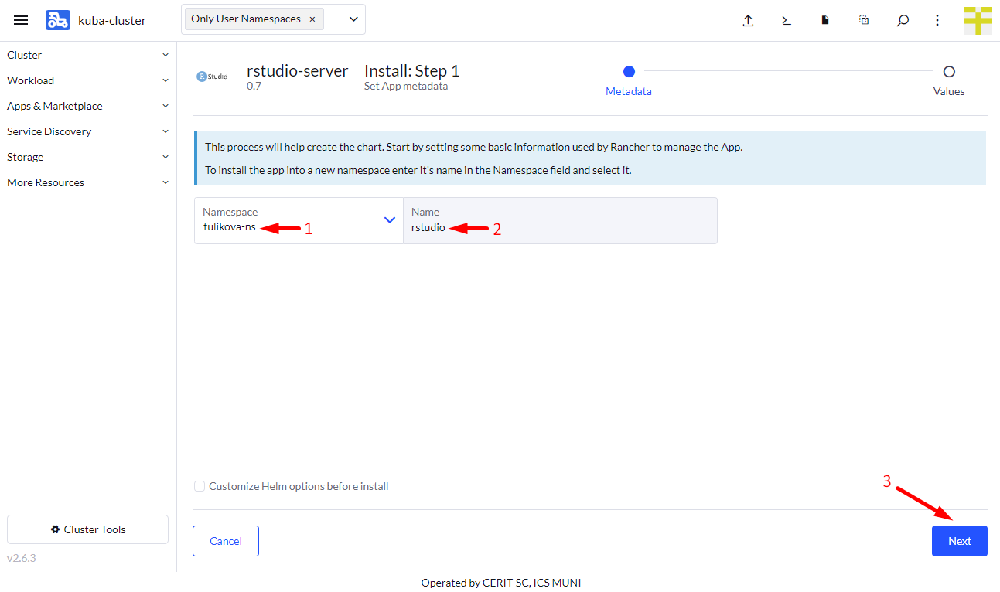
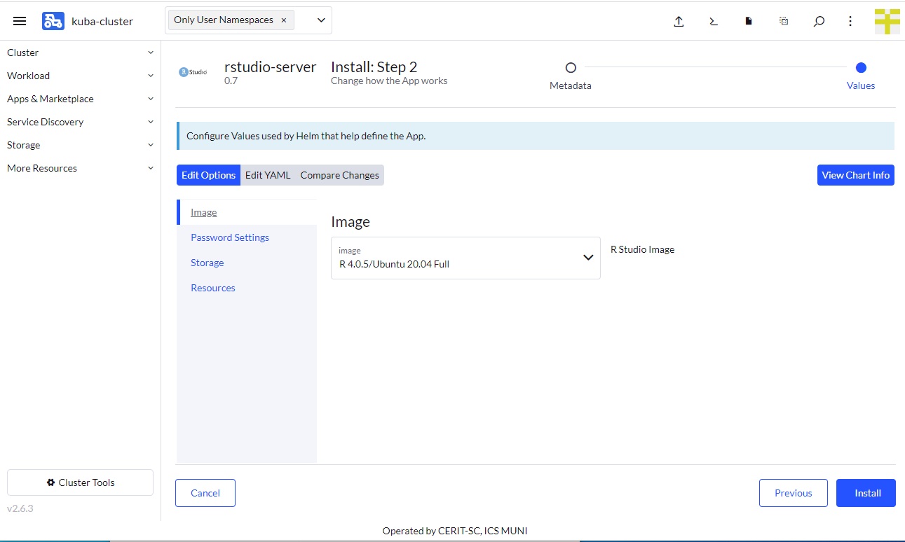
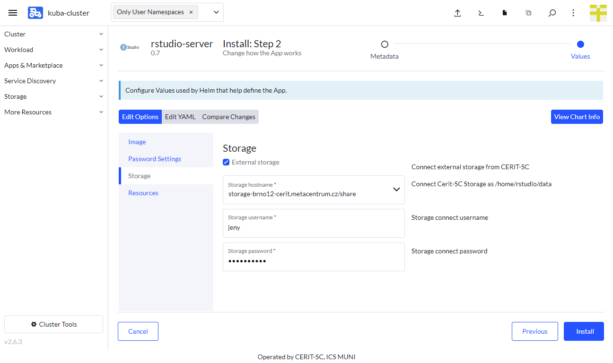
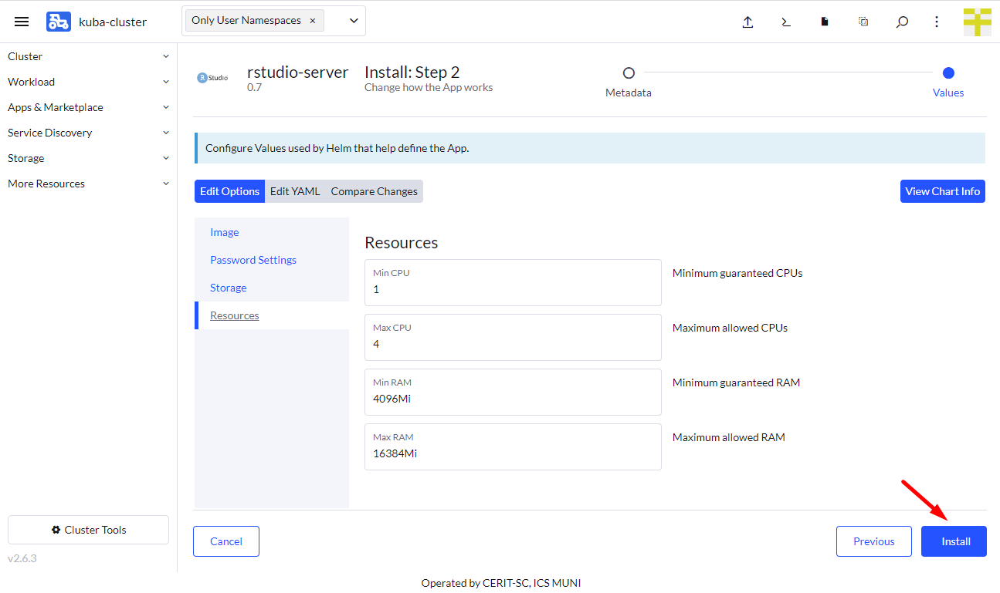
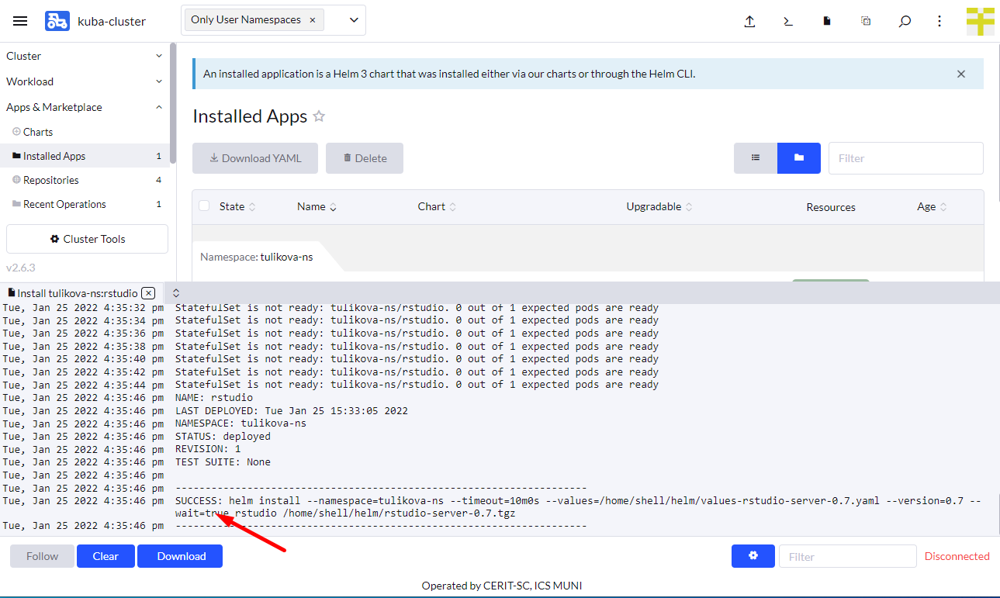
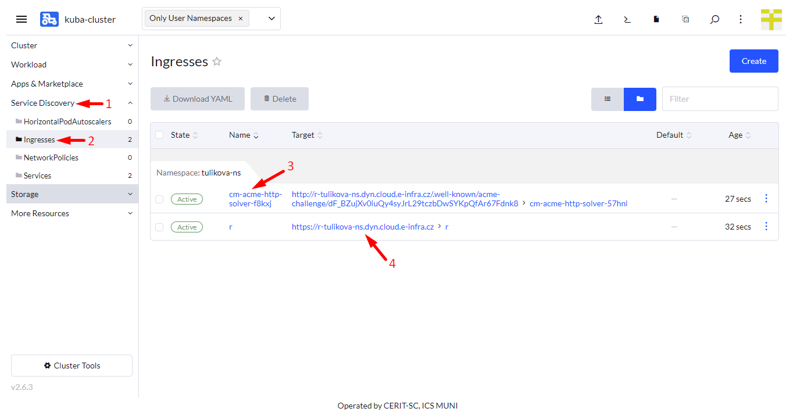
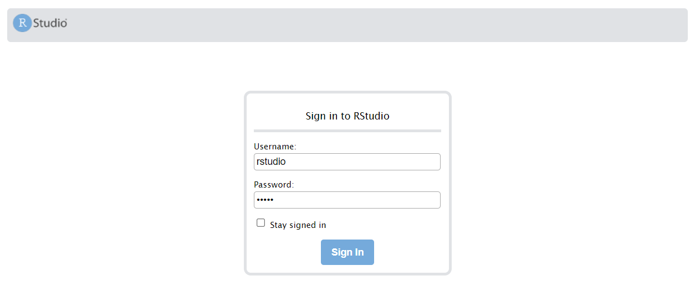
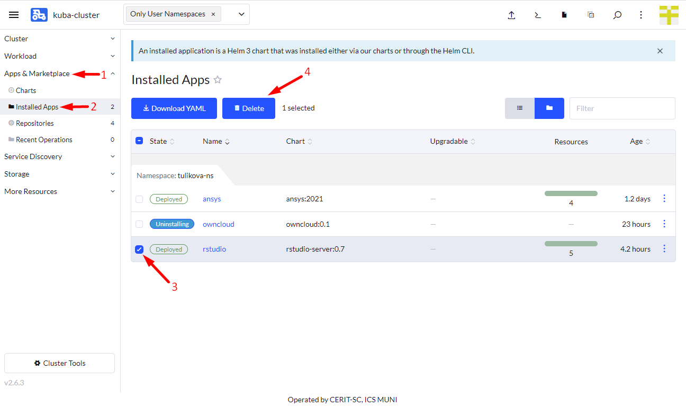

## Running RStudio

If not already logged, log to [rancher.cloud.e-infra.cz](https://rancher.cloud.e-infra.cz), see [Rancher](/containers-compute/rancher) section.

Following the steps below, you can install RStudio web application. This application has persistent home directory, it means, that if you delete the application and later install the application again preserving its name, content of home directory will be preserved.

### Notes

* Default project had quota limit for 12 guaranteed CPUs and quota for 16 CPUs limit. Do not select more than 10 guaranteed CPUs and more than 14 CPUs limit. If needed more just [ask](mailto:k8s@ics.muni.cz). This may be increased in future so request for more CPUs can be made. 

### Select Application to Run

Navigate through `Only User Namespaces` (1), `App & Marketplace` (2), `Charts` (3), `cerit-sc` (4),  and select `RStudio` (5). See screenshot below.

### Install the Application

When you click on the chart, hit `Install` to continue.

Now you can install the RStudio application. In most cases, keep both `Namespace` (1) and `Name` (2) intact, however, you can select namespace as desired except `default`. The `default` namespace is available but it is not meant to be used. The `Name` will be in URL to access the application. The `Name` must be unique in the `Namespace`, i.e., you cannot run two or more instances with the same `Name` in the same `Namespace`. If you delete the application and later install the application again preserving its `Name`, content of home directory will be preserved.

In the first part of the form, you choose R image, using it you select R version. Image with `Full` tag contains most of system libraries and also allows to install additional system packages using `fakeroot` command like `fakeroot apt-get install libssl-dev`. However, if application is restarted or reinstalled, all installs using `fakeroot` are lost and has to be installed again.

In the second part of the form, you select access password, please avoid chars like `{`, `}`, non trivial password is strongly recommended, however, it is also strongly recommended not to use a password you already use somewhere else. Username will be just **`rstudio`**.

In the third part of the form, you can select **e-infra** storage to connect to the application. If you check `External Storage`, few more options appear. You can select storage and access credentials. Currently, only `storage-brno12-cerit.metacentrum.cz` and `ha-bay.ics.muni.cz` are supported. Username is e-infra ([metacentrum](https://metavo.metacentrum.cz/)) login and password **is not** Metacentrum password, but different set by administrator, [ask](mailto:k8s@ics.muni.cz) if you need to set. We are preparing more convenient way. For `ha-bay.ics.muni.cz` use UČO and secondary password, however, creating service account and using it is recommended. This storage is mounted to `/home/data` directory.

In the fourth part  of the form, you can select requested resources. This step is optional. `Minimum` CPU or RAM is guaranteed amount of CPU and RAM, system reserves these resources for the application. However, the application can exceed guaranteed resources up to `Maximum`. However, in this case, resources are not exclusive and can be shared among other applications. If the application exceeds `Maximum` CPU, it gets limited, if it exceeds `Maximum` RAM, it gets terminated (you will see OOMKill report) and restarted. See note above about maximum values.

### Wait for Application to Start

When you hit `Install`, you will see installation log. Once you see `SUCCESS` (see screenshot below), the application is running. 

### Login to the Running Instance

Once the application is running, navigate through `Service Discovery` (1) and `Ingresses` (2). You will see `Ingresses`. If you see `cm-acme-http-solver...` (3), wait until it disappears. Once you see `rstudio` or whatever `Name` you used in the previous steps, you can click on Target (4) to log in to the application.

You will see log in window, use **`rstudio`** as login name and the selected password from the from.

## Delete Running Instance

If you feel you do not need the application anymore, you can delete it. Just navigate to `App & Marketplace` (1), `Installed Apps` (2), select the application (3) and hit `Delete` (4). The data in home directory is not deleted. Running the application again with the same `Name` restores access to the home directory folder.

