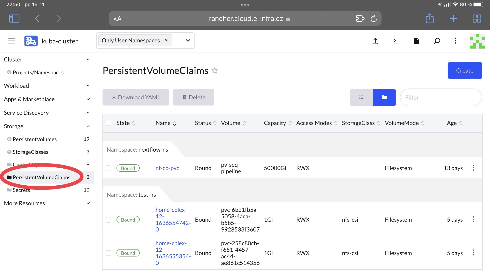

Kubernetes orchestrator offers several ways to utilize infrastructure storages. There are three important Kubernetes objects related to storage: *Storage Class*, *Physical Volume (PV)*, *Persistent Volume Claim (PVC)*. 

## Storage Class

[Storage class](https://kubernetes.io/docs/concepts/storage/storage-classes/) provides a way for administrators to describe the "classes" of storage they offer. Different classes might map to quality-of-service levels. We offer the following storage classes:

1. csi-ceph-rbd-du -- storage class backed up by CEPH RBD block volumes from DU CESNET facility. The block volume is formated e.g., as `ext4` local file system that can be connected to a single Pod.
2. nfs-csi -- default dynamic class that uses NFS as connection protocol. Dynamic class means that volumes can be created ad-hoc as user requests them. 
3. sshfs -- storage class that allows to use SSH protocol to connect to remote node (not necessarily storage node) and provide file system that is connected to a Pod.

The table below describes performance characteristics of each storage class, in addition to these class, we provide CIFS storage characteristics that is also available not through *Storage class*, see below.

|Storage type|Read IOPS|Write IOPS|Read Linear|Write Linear|
|:---|---:|---:|---:|---:|
|Local SSD|98800|82800|1000MiB/s|947MiB/s|
|nfs-csi|30700|22000|755MiB/s|1093MiB/s|
|csi-ceph-rbd-du|496|814|224MiB/s|188MiB/s|
|sshfs|13400|41200|171MiB/s|179MiB/s|
|CIFS|19300|16900|372MiB/s|483MiB/s|


## PV

PV represents physical volume that is responsible for storage connecting. Only administrator can create PV and it is cluster wide resource (not namespaced). 

## PVC

The PVC represents some kind of persistent storage that can be mounted into
a *pod*. PVCs are usually network volumes, e.g., NFS or CIFS/SMB. These kind
of PVCs can be mounted to many pods simultaneously thus making it a shared
storage among pods.

* User can create an ad-hoc PVC using [pvc.yaml](/deployments/pvc.yaml)
   template. Downloading it and filling proper `name` and `storage` size and
   issuing command:

    ```
kubectl create -f pvc.yaml -n namespace
    ```

    where `namespace` is user namespace as can be seen in Rancher GUI, usually
    *surname-ns*. The ad-hoc pod does not contain any data in advance, the user
    needs to populate the data on his/her own. PVC name is the exactly the
    same you fill in the `name` value. User can choose different storage class according to description above.

* Another option is to create PVC as CIFS storage from CERIT-SC. In such a case,
    user needs to download [secret.yaml](deployments/secret.yaml),
    fill in proper `name` and the following two annotations: `cerit.io/storage`,
    `cerit.io/share`. Those values from the example work for *storage-brno12-cerit* as
    they are, they make access to users home directory. For share `project` folders, `cerit.io/share` has to be set to: `cerit.io/share: 'export/nfs4/projects/project_name'`.
    User also needs to fill in `mount_flags`. The `mount_flags` is
    base64 encoded string that can be obtained using the following command:
    ```
echo -n "username=USER,password=PASS,uid=1000,gid=1000,nosetuids,vers=3.11,noserverino" | base64
    ```
    where `USER` and `PASS` are username and password accessing
    *storage-brno12-cerit*, resp. In case the `USER` is UČO, `domain=UCN` needs to
    be added into the `echo` command as another comma separated value, i.e.,
    ```
echo -n "username=USER,password=PASS,uid=1000,gid=1000,nosetuids,vers=3.11,noserverino,domain=UCN" | base64
    ```

    In case, you do not know CIFS password for CERIT-SC storage, just ask for one
    on [support@cerit-sc.cz](mailto: support@cerit-sc.cz). It is **not** the same password you use for logging
    into infrastructure!

    Be aware that the base64 encoded string is not encrypted, so keep it secret!

    Once the user created secret.yaml file, it needs to be uploaded into
    Kubernetes via the following command:
    ```
kubectl create -f secret.yaml -n namespace
    ```
    The `namespace` is the same as in the previous case. PVC name is derived
    from the `name` value and will be: `pvc-name`. In this case, PVC will not
    be empty, it contains data from your home from storage-brno12-cerit.

* The last option is to request admins to create special PVC for you according
to your needs. You can request it at [k8s@ics.muni.cz](mailto: k8s@ics.muni.cz).

You see your PVCs in Rancher GUI in `Storage` &rarr; `PersistentVolumeClaims` 

## Ephemeral Storage

Ephemeral kind of storage is allocated from node's local storage. Allocation is done through resource requests, see [resources](/docs/resources.html) and through volume mounts.

Ephemeral storage can be allocated from local disk or local memory. If a Pod is evicted or moved to another node, content of ephemeral storage is lost.

Ephemeral storage from local disk:

```yaml
volumes:
- name: eph
  emptyDir:
    sizeLimit: 10Gi

volumeMounts:
- name: eph
  mountPath: /data
```

Ephemeral storage from local memory:

```yaml
volumes:
- name: mem
  emptyDir:
    medium: Memory
    sizeLimit: 1Gi

volumeMounts:
- name: mem
  mountPath: /tmp
```

In case of local memory, see requirements on [memory resources](/docs/resources.html).
