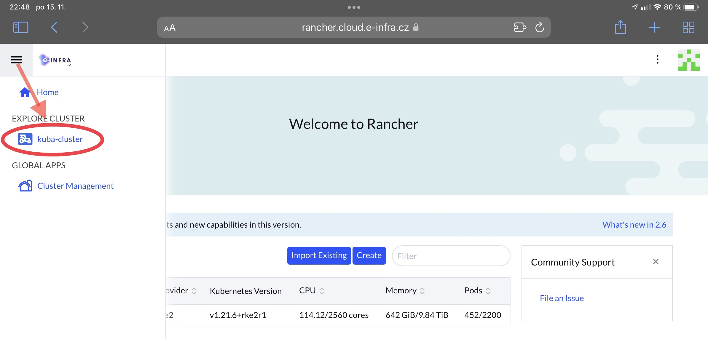
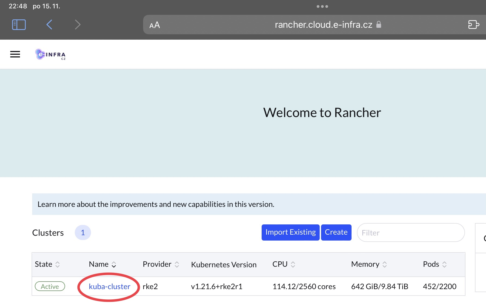
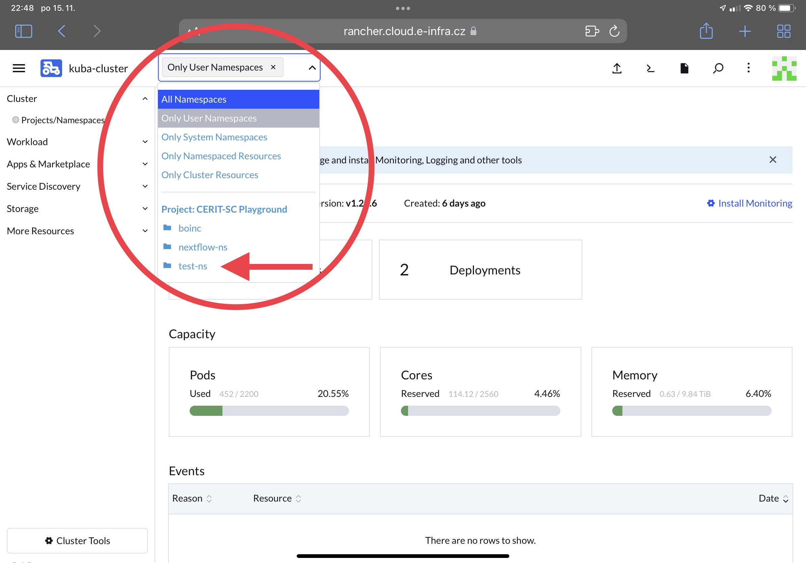

_Rancher_ instance is available on [rancher.cloud.e-infra.cz](https://rancher.cloud.e-infra.cz). Please login via CESNET, ELIXIR or EGI.
After logging in, you shall see default dashboard. You should see default cluster as shown below. If none cluster is shown, please, realod the page, it can take up to one minute before a cluster is shown.

World of Rancher and Kuberntes is organized into *clusters*, *projects*, and *namespaces*. *Clusters* correspond to sets of physical nodes. *Projects* are created within the *cluster* and *namespaces* are created within the *Projects*. The *Projects* are purely Rancher concept and they are not Kubernetes native concept. [Namespaces](https://kubernetes.io/docs/concepts/overview/working-with-objects/namespaces/) provides a mechanism for isolating groups of resources within a single cluster. Names of resources need to be unique within a namespace, but not across namespaces. Names of namespaces need to be unique within a cluster. I.e., it is usually not a good idea to create namespace called *test* and so on.

Each user is given a *Default Project* with name and surname and default *namespace* called `surname-ns`. The *Default Project* and default *namespace* is created automatically on the first login to Rancher dashboard. User can create additional namespaces either using kubectl or in the Rancher GUI. Creating namespaces using kubectl is not recommended way, therefore no example here, as kubectl's created namespaces are not linked to user *Project*. Instead, a user should create namespace in Rancher GUI in Namespace overview hitting `Create Namespace` button. See [quota](/docs/rancher-quotas.html) for more information related to creating namespaces and quotas.

You can find assigned clusters which you are allowed to access either in upper left corner:

or just in the list on home page:

When you select a cluster, you can display your *projects and namespaces*

It is possible to work to certain extent only with Rancher. However, command line tool `kubectl` allows more actions. You can utilize both ways but we do not recommend `kubectl` for users inexperienced with working in terminal.
