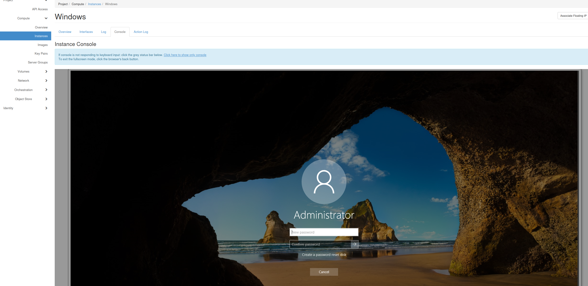
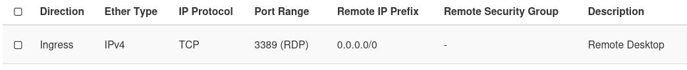

---

title: Windows
search:
  exclude: false
---

# Windows

Windows host system allows RDP access allowed for the `Administrators` group. By default there are two users in this group:

- Admin - the password for this account is defined by `admin_pass` OpenStack instance metadata, if no value is entered for this key, a random password is generated. (could be used for orchestration). The `admin_pass` functionality depends on used image, it happens that it does not work for certain images.
- Administrator - the password must be filled after instantiation of the system, when logging in for the first time. This can be typically done through console of desired instance as you can see in example.

!!! example

    

We recommend disabling those accounts, creating new ones to administer Windows instances in any production environment.

The next step is to create a security group, that will allow access to a port `3389` ([RDP protocol](https://en.wikipedia.org/wiki/Remote_Desktop_Protocol)) for the instance. In the example you can see correct settings of security group for IPv4.

!!! example

    

# Licensing

- We are not currently supporting Windows licensing. License responsibility for Windows is entirely up to the user.

# Advanced Users

- You may use all features of [cloudbase-init](https://cloudbase.it/cloudbase-init/) for Windows.
- Windows Server [hardening guidelines](https://security.uconn.edu/server-hardening-standard-windows/).
