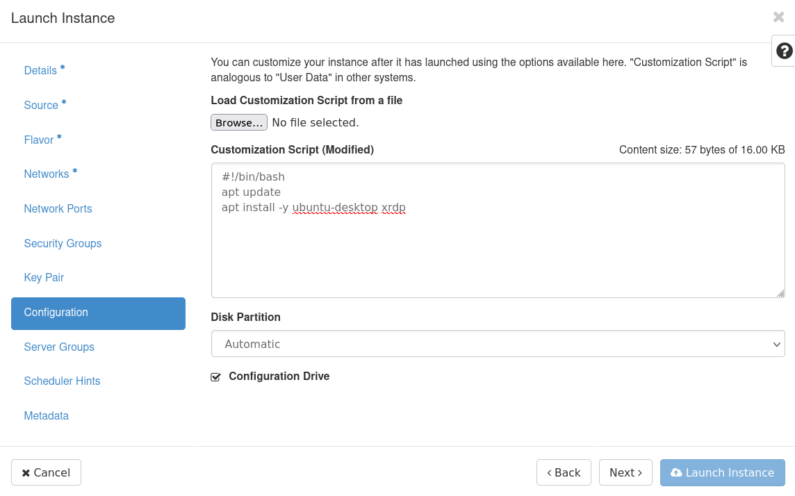
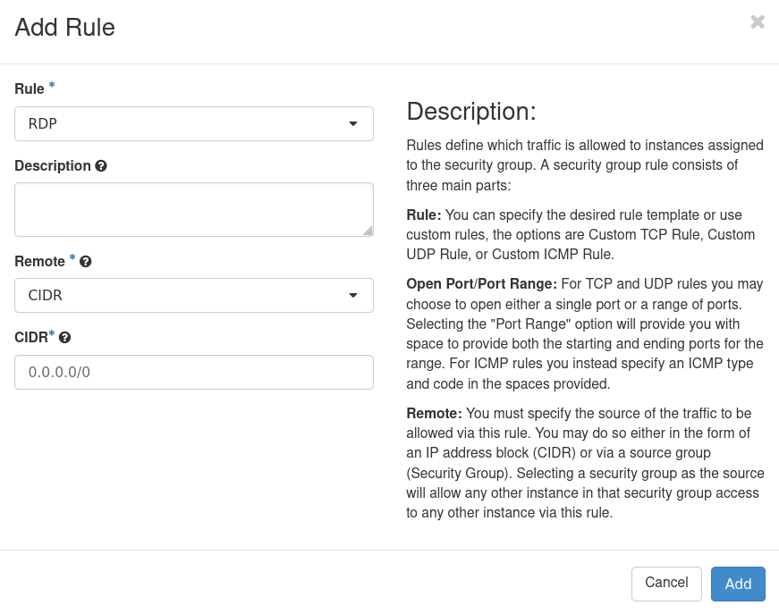

# Accessing Instances
This page provides instructions on how to access virtual instances in OpenStack. Instances are virtual machines running on a cloud infrastructure. Whether you are an administrator or end user, this page will guide you through accessing and interacting with your instances on OpenStack.

## Prerequisites
Before you can access instances running on OpenStack, you should have met the following prerequisites:

- [Created networking](../how-to-guides/create-networking.md): You should have created a network in OpenStack that your instances can connect to.
- [Configured Security groups](../getting-started/creating-first-infrastructure.md#update-security-group): You should have configured security groups in OpenStack to allow traffic to and from your instances.
- [Imported SSH key](../getting-started/creating-first-infrastructure.md#create-key-pair): If you plan to access instances, you should have imported an SSH key into OpenStack that you can use to authenticate with your instances.
- [Created Virtual machine](../getting-started/creating-first-infrastructure.md#create-virtual-machine-instance): You should have created a virtual machine instance in OpenStack that you want to access.
- [Associated Floating IP](../how-to-guides/managing-floating-ips.md): If you plan to access instances from outside the OpenStack environment, you should have associated a floating IP with your instance.

If you are unsure about any of these prerequisites, please refer to the relevant documentation page for more information.

## Access Methods
There are several different methods that you can use to access instances running on OpenStack. Here is a brief overview of each method and their benefits and limitations:

- **SSH**: Secure Shell (SSH) is a command-line interface that allows you to remotely connect to a virtual machine instance running on OpenStack. SSH provides secure access to your instances and is a popular choice for Linux-based instances. However, SSH can be difficult to set up for novice users, and it may not be the best option for users who require a graphical interface.
- **Remote desktop**: Remote desktop allows you to access your instances through a graphical interface, similar to what you might see on your local machine. OpenStack supports several remote desktop protocols, including Remote Desktop Protocol (RDP) for Windows-based instances and Virtual Network Computing (VNC) for Linux-based instances. Remote desktop is user-friendly and provides a familiar interface for users. However, remote desktop may not be as secure as SSH, and it may be slower than other access methods, especially when accessing instances over the internet.
- **VNC**: Virtual Network Computing (VNC) is a graphical desktop sharing system that allows you to remotely control a desktop environment. VNC is widely used for accessing Linux-based instances on OpenStack. VNC provides a graphical interface similar to remote desktop, but it may be more flexible than remote desktop in terms of customization options. However, VNC can be complex to set up and may require additional software on your local machine.

Consult the relevant documentation for each access method for more detailed instructions on how to set up and use each method.

## Connecting to Instances
To connect to instances running on OpenStack, you can use one of the available access methods, such as SSH, remote desktop, or VNC. Here are step-by-step instructions on how to connect to your instances using each method:
=== "Linux"

    ### SSH
    - Import your private SSH key corresponding to your public SSH key in the VM into folder `~/.ssh/id_rsa` for key authentication.
    - Open a terminal window on your local machine.
    - Use the `ssh` command and the IP address or hostname of your instance to establish a connection. For example:

    ``` example
    ssh ubuntu@147.251.100.100
    ```

    For more detailed instructions on how to connect using SSH, consult the relevant documentation for your operating system.

    ### Remote Desktop on Ubuntu
    You can connect to a Linux machine in a similar way as to MS Windows using xrdp, which is an open-source version of Microsoft's remote desktop protocol. However, Linux cloud images are not ready for xrdp connection in their basic state and some steps need to be taken.

    1. Install graphical user interface and xrdp service. The installation can be done manually after accessing through ssh, but due to the longer GUI installation time and especially in the case of creating a large number of virtual machines, we recommend using the `Customization Script`. The minimal version of the script for Ubuntu linux looks like this:

        ``` bash
        #!/bin/bash
        apt update
        apt install -y ubuntu-desktop xrdp
        ```

        !!! example

            

        Since the installation using the Customization Script takes place in the background, it is not entirely clear when it will be completed. You can imagine the installation time as 1 hour, but it's not exact. The presence of the packages can be confirmed by the following command launched through an ssh connection:

        ``` bash
        sudo apt install ubuntu-desktop xrdp
        ```

        If the command returns an error message due to being locked by another process, the installation is still running in the background.

    2. The basic user accounts in Ubuntu cloud images are not used for logging in, it is therefore necessary to create a new user account via ssh before logging in via xrdp. In the following example, the creation of a regular (non-root) user `graphical-user` is presented:

        ``` bash
        sudo useradd -m -g users graphical-user
        sudo passwd graphical-user
        ```

    3. Allow xrdp connection by adding appropriate rule to the VM's security group. The port number is `3389`, but direct `Rule: RDP` option is also available.

        !!! example

            

        !!! caution

            The virtual machine is ready for connection using xrdp. However, it should be noted that xrdp (as well as the original rdp) were not designed for encrypted communication and a machine configured in this way is not suitable for transferring sensitive information (e.g. logging into web applications used in everyday life, such as banking and the like). For some purposes, unencrypted traffic may be sufficient, but for greater security we recommend setting up additional [SSL/TSL Encryption](https://karthidkk123.medium.com/how-to-secure-xrdp-on-ubuntu-centos-with-ssl-tls-encryption-9258162b24a3).

    4. If the guide above was followed, it should be possible to connect to the Ubuntu VM and use its GUI with the use of an rdp client. RDP client is a desktop application, that understands rdp traffic and opens a window containing interactive desktop of the remote host.
        - In Windows environment, `Microsoft Remote Desktop` should already be installed inside the operating system.
        - For MacOS `Microsoft Remote Desktop` can be downloaded from Mac App Store.
        - Linux workstations offer several clients. One of the widespread ones (this one is also tested to work) is called `Remmina`.

    ### VNC
    - Install a VNC client on your local machine.
    - Obtain the VNC server IP address and port number from your instance's console or dashboard.
    - Use the VNC client to connect to the server IP address and port number.
    - Enter your username and password when prompted.
    - Once you are connected, you can interact with your instance using the graphical interface.

    For more detailed instructions on how to connect using VNC, consult the relevant documentation for your VNC client.

=== "Windows"

    ### PuTTY
    - Open [PuTTY](https://www.chiark.greenend.org.uk/~sgtatham/putty/faq.html#faq-what) and enter the IP address of your instance in the "Host Name" field.
    - Select `SSH` as the connection type.
    - Go to `Connection -> SSH -> Auth -> Credentials` and browse to the private key file.
    - Click `Open` to start the connection.
    - Enter your username when prompted, username topic is discussed in [FAQ](../additional-information/faq.md).

    For more detailed instructions on how to connect using PuTTY, consult the relevant documentation for your operating system.
    ### Remote desktop
    - Open the Remote Desktop Connection client on your local machine.
    - Enter the IP address or hostname of your instance in the `Computer` field.
    - Enter your username and password when prompted.
    - Click `Connect` to establish a connection.
    - Once you are connected, you can interact with your instance using the graphical interface.

    For more detailed instructions on how to connect using remote desktop, consult the relevant documentation for your operating system.

## Troubleshooting
- **Verify network connectivity**: If you are unable to access instances, first make sure that you have network connectivity to the OpenStack environment. Check your network connection and ensure that your IP address is in the correct range. You should also ensure that any firewalls or security groups are configured to allow access to the instances.
- **Verify credentials**: If you are unable to authenticate when attempting to access instances, verify that you are using the correct username and password or SSH key pair. You may also need to check that your credentials have the appropriate permissions to access the instances.
- **Check instance status**: If you are unable to connect to an instance, check its status in the OpenStack dashboard. If the instance is not in an ACTIVE state, there may be an issue with its configuration or the underlying infrastructure. Try rebooting the instance or creating a new instance with similar configurations.
- **Check logs**: If you are still unable to connect to an instance, check the logs for any errors or warnings. The OpenStack console log and the instance's system log can provide useful information on what might be causing the issue.
- [**Check FAQ**](../technical-reference/brno-g1-site/faq.md): If you approach an issue when connecting to our infrastructure, make sure to first check FAQ before contacting support.
- **Contact support**: If you are unable to resolve the issue on your own, contact your OpenStack support team for further assistance. Be sure to provide as much information as possible, including error messages and steps you have already taken to troubleshoot the issue.

## Security Considerations
- **Use SSH keys**: Always use SSH keys (instead of passwords) to access instances. Passwords are susceptible to brute force attacks.
- **Restrict network access**: To minimize the risk of unauthorized access, it is recommended to restrict network access to only the necessary ports and protocols needed to access the instances. Security groups can be used to control inbound and outbound traffic to instances.
- **Limit user access**: Only users who need to access instances should have the necessary credentials to do so. It is important to restrict user access to only the instances they need to work on and remove access when it is no longer needed.
- **Monitor access logs**: Monitoring access logs can help detect and prevent unauthorized access. OpenStack provides logs that track user access and activity within the environment, and users should review these logs on a regular basis.
- **Keep instances up-to-date**: Keeping instances up-to-date with the latest security patches and updates can help prevent security vulnerabilities from being exploited. It is recommended to regularly apply updates and patches to instances to maintain their security posture. Utilities like [unattended-upgrades](https://wiki.debian.org/UnattendedUpgrades) or [dnf-automatic](https://dnf.readthedocs.io/en/latest/automatic.html) can help you automate security updates.
