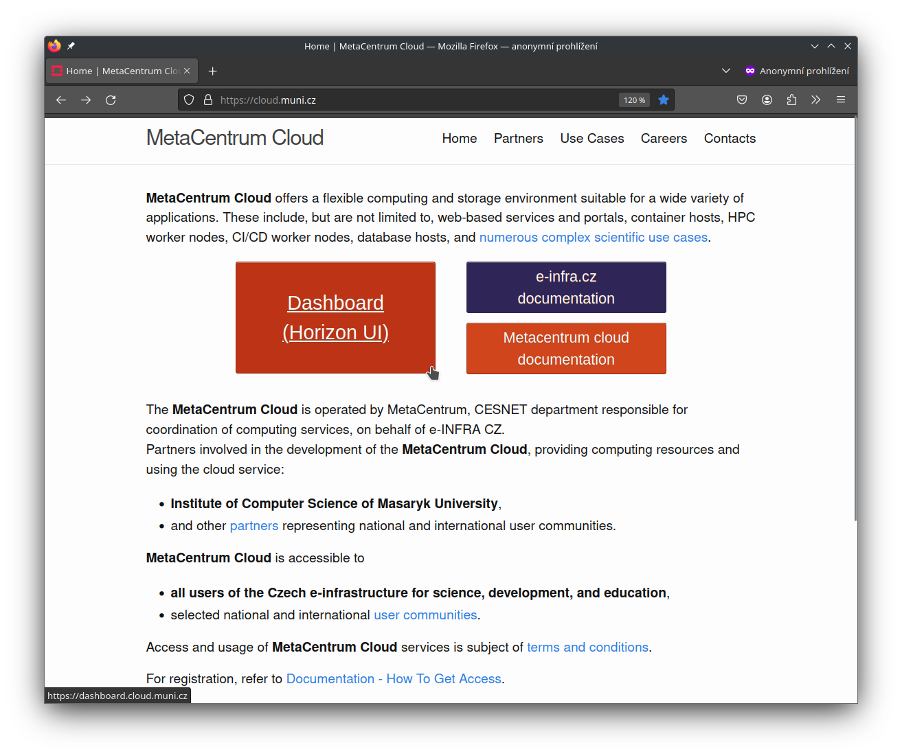
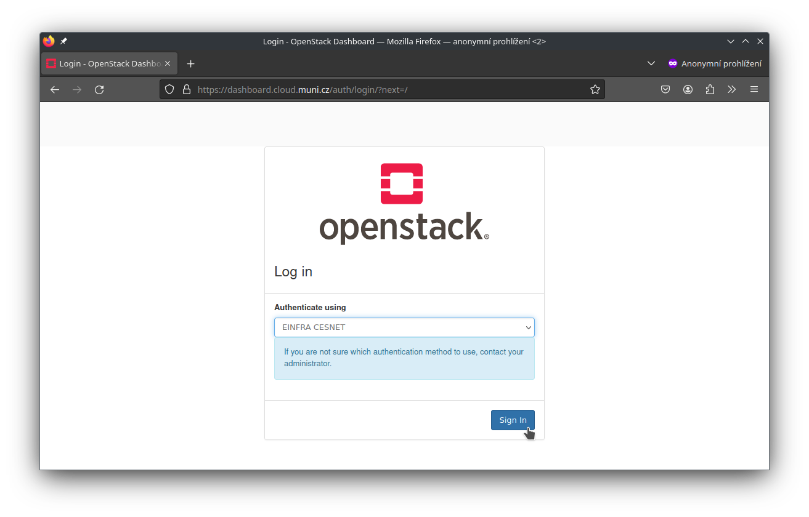
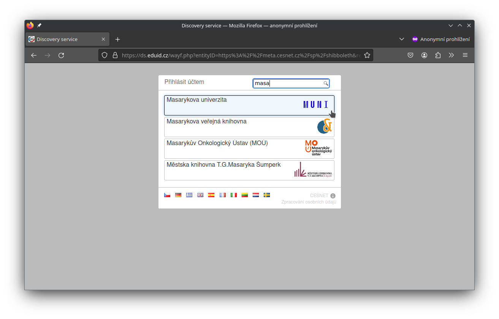
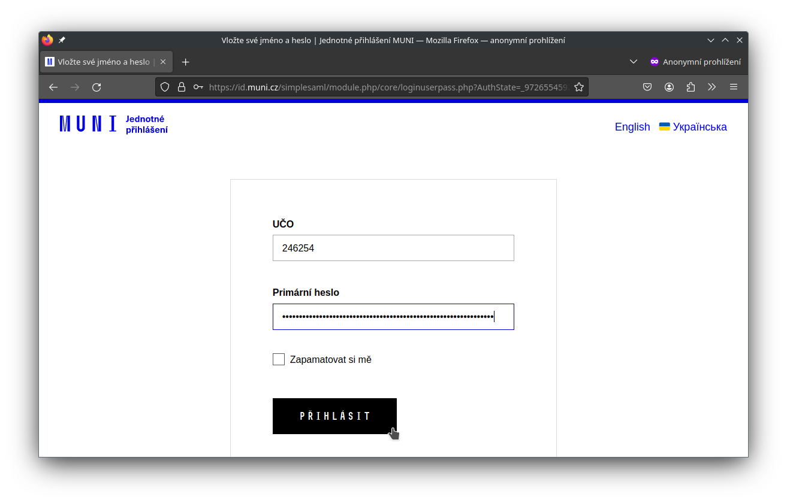
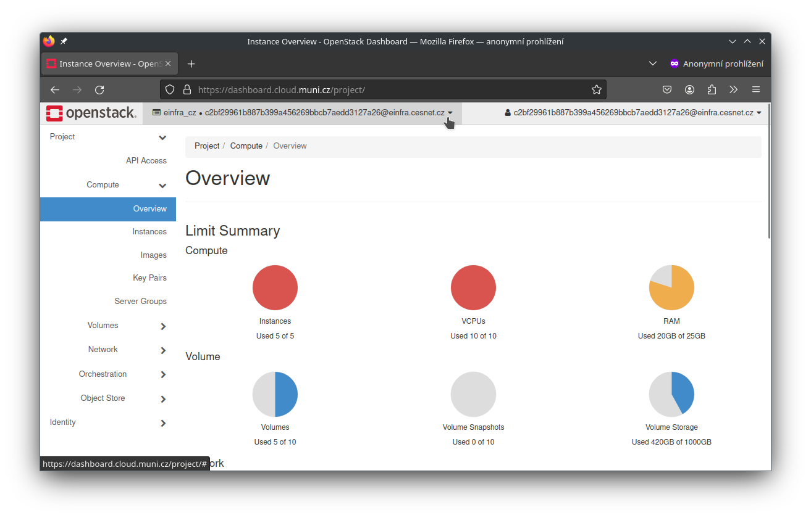

---

title: Accessing UI Dashboard
search:
  exclude: false
---

# Accessing Horizon Dashboard

**1.** Go to [cloud.metacentrum.cz](https://cloud.metacentrum.cz/) (eventually [cloud.muni.cz](https://cloud.muni.cz/)), click Dashboard

!!! example

    

**2.** Login to Horizon dashboard using e-INFRA CZ federation

!!! example

    

**3.** Select your organization (filtering for Masaryk Univerzity)

!!! example

    

**3.** Confirm your identity at your organization page (Masaryk Univerzity)

!!! example

    

**4.** OpenStack Horizon dashboard (personal project)

!!! example

    
