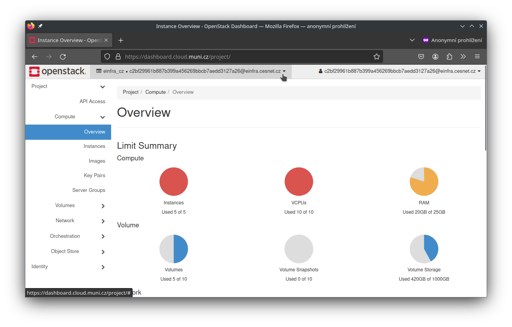
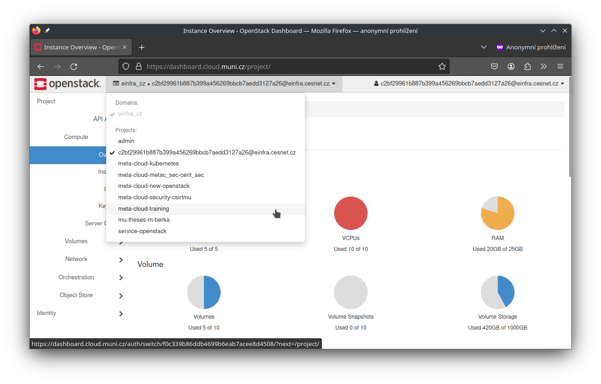
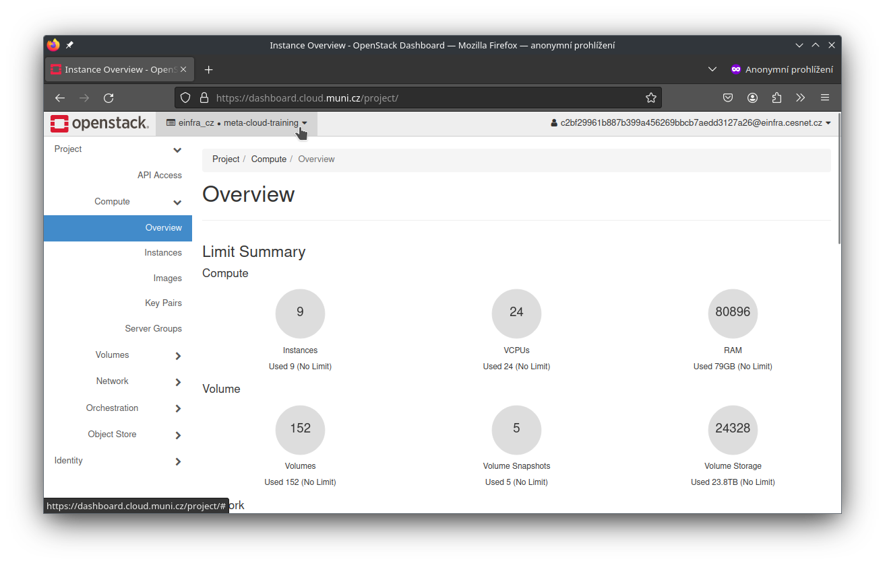

---

title: Selecting OpenStack project
search:
  exclude: false
---

# Selecting OpenStack project in Horizon dashboard

## Prerequisites

- [Login to OpenStack Horizon](./accessing-openstack-dashboard.md).

## Changing current project

**1.** Initially we are on personal project

!!! example

    

**2.** Clicking on top left project drop down we can select project (selecting project meta-cloud-training)

!!! example

    

**3.** Finally we switched to new project

!!! example

    
