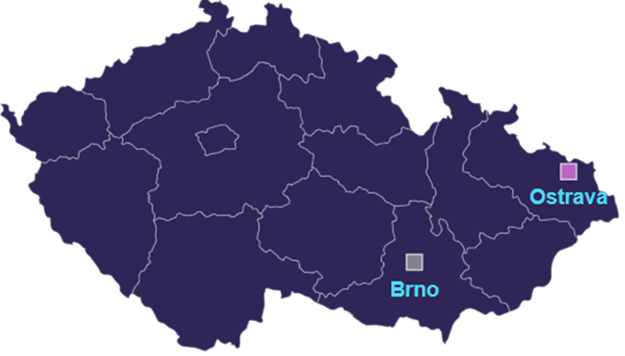

# Migration to the new generation of OpenStack cloud services
e-INFRA CZ is upgrading its cloud service to improve operational efficiency and reliability. The new architecture spans over Brno and Ostrava datacenters. The Brno site will need to be migrated, staring during Q1/2024. The process involves gradually transitioning user workloads, ensuring minimal disruption and close cooperation with principal investigators

## Introduction
The cloud, which is used daily by approximately 250 e-INFRA CZ users supported by the flexibility of the cloud and performance of the HPC system's broad spectrum of research activities in the Czech Republic. The cloud services in current generation was introduced on the network of Masaryk University in 2017 and was built on more than 300 physical machines. The design of the cloud service was at that time very smart. We have utilized the power of “Infrastructure as a code” principle, having all configuration in git repositories. Thanks to the IaC it is easy to track changes to the infrastructure, ensure it’s consistency and integrity, do team reviews and run continuous integration and deployment for automatic rollout of changes to the infrastructure. Utilization of this principle is widely used by software developers, where these practices are much easier to implement. The time has passed and the technologies we used to use to manage the cloud system, which was our own set of Puppet and Ansible scripts are now a bit deprecated, and there are better alternatives out there, supported by a broader community. These new tools do the work in a more efficient manner. 

In order to improve the quality of the cloud service to best serve its users in the national computing infrastructure of e-INFRA CZ, we have decided to perform a generational upgrade of the hardware and software of the cloud service. Since the beginning of 2023, together with our partners from IT4I and a Czech commercial partner, we have started working on a more robust and up-to-date way to run a cloud service on top of OpenStack. Our goal was to reduce the cost of cloud operation, increase the scalability of the cloud to different types of workloads (resiliency, high-performance) and different locations, e.g. in other e-INFRA CZ datacenters. 

The solution is [Beskar.cloud](http://beskar.cloud/), our distribution of OpenStack cloud, which uses many open-source tools such as Kubernetes, Ubuntu operating system, Ansible, Prometheus monitoring stack and more. The cloud infrastructure of e-INFRA CZ is based on this distribution.

## Architecture since 2024
The new architecture based on Beskar.cloud uses two e-INFRA CZ datacentres in the CZ. From 2024 it is therefore possible to obtain computing resources in the Brno datacentre and in the same way in the Ostrava datacentre on the cloud partition of the Karolina supercomputer.    

## Changes needed to achieve the new architecture
Currently, all running virtual machines running in the current cloud service are physically located in the datacenter in Brno. In order to get the cloud service in Brno into the new architecture, we will have to gradually migrate the user workload from the old cloud to its new version. This will happen during Q1/2024 and we will inform the affected users in time.

### The tentative migration schedule is as follows:

1. workload grouping according to the migration complexity - simple topologies and small data to more complex topologies, taking into account the user's knowledge of managing these workloads - starting 2024
1. Automated migration of simple user workloads
1. Controlled migration of user workloads with complex topologies
1. Migration of complex use-cases
1. Deprecation of Brno GEN1

Principal investigators of each of the workflows that are subject to the migration to the next generation cloud service will be informed in time because we need close cooperation to ensure that the migration takes place without as little disruption as possible.

This change doesn’t apply to the new cloud site deployed in the Ostrava. Since the end of 2023 it is possible to request resources in the Ostrava site, see the [documentation](https://docs.e-infra.cz/compute/openstack/technical-reference/ostrava-g2-site/get-access/).

## Process of the migration

### Pre-Migration Communication
Our team will reach out to you in advance to discuss and schedule the migration. This will include determining a suitable time for the migration, addressing any concerns you may have, and providing detailed information about the process.

### Collaboration Requirements
We will collaborate closely with you to understand any specific requirements or considerations related to your projects. Your input is valuable in ensuring a seamless migration experience.

### Migration Parameters and automation
As part of the preparation, we will discuss and finalize important parameters such as new IP addresses and any other relevant details needed for the migration. Your cooperation in providing this information will contribute to the success of the migration.
Migration process steps depend on an approach whow a cloud user deployed existing infrastructure. There are basically two migration approaches discussed in the next chapters. Migration in both cases causes outages.

#### My GEN1 Brno infrastructure is already automated
If the pre-migration cloud infrastructure is automated some way (Terraform, OpenTofu, Terragrunt, Pulumi, Heat or openstack client scripts) then it is easier to create identical infrastructure in GEN2 Brno cloud and migrate application data. Detailed migration example and automation code which has to be slightly reconfigured is [discussed below](#gen1-infrastructure-deployment-is-automated-terraform-openstack-client-) in the FAQ section.

#### My GEN1 Brno infrastructure is not automated
There are of course cases when automation is not in place or cannot be used (as for instance migration of application data is time consuming). In these cases migration is performed by a Continuous Integration pipeline prepared by cloud admins team and performs briefly following steps:

* Existing GEN1 VM servers are stopped
* GEN2 VM servers, including attached volumes and surrounding network, subnet and floating IP entities are created
* Block storage data from GEN1 cloud is snapshotted and transferred into pre-created GEN2 cloud infrastructure.
* GEN2 infrastructure is started
* DNS records changed to GEN2 cloud IP addresses if they exist.
* GEN1 infrastructure is deleted once cloud user acknowledges GEN2 infrastructure functionality

See [detailed migration example](#gen1-infrastructure-deployment-is-not-automated) below in FAQ section.

Migration of the personal (free-tier) projects workload may be launched by cloud user him/herself ([see details below](#may-i-perform-my-workload-migration-on-my-own)), in all other cases e-INFRA CZ cloud team initiate the migration.

The cloud personal (free-tier) projects which are intended for [testing and learning purposes](https://docs.e-infra.cz/compute/openstack/technical-reference/brno-g1-site/get-access/#personal-project), will be migrated by cloud users themself or upon explicit request to cloud team. The personal projects with no care are getting archived for a short period and deleted.

## Technical migration details

### Most visible changes in GEN2 Brno cloud
* [New flavor naming][g2b-flavors]
* New network naming
* New Horizon and API URLs
* Different ipv4 public IP network range(s)

### GEN1 to GEN2 Brno cloud flavor mapping
The flavor naming scheme was reworked in GEN2 to be generally more consistent and support fast ceph storage which is planned.

Details on how to map GEN1 flavor names into GEN2 can be found [here][g2b-flavors].

## Resources to help with migrations
[e-INFRA CZ cloud documentation][general-docs] on [GEN1][gen1-docs] and [GEN2 Brno][gen2-docs] clouds discusses most important facts about cloud sites.

[Infrastructure as Code (IaC) automation repository][iac-repo] shows how to effectively work with OpenStack clouds and also [highlights differences needed when launching identical infrastructure in another cloud][iac-repo-highlights].

## e-INFRA CZ IaaS cloud comparison matrix

<table>
    <tr>
        <th colspan="2" valign="top"></th>
        <th valign="top">Brno GEN2</th>
        <th valign="top">Ostrava GEN2</th>
        <th valign="top">Brno GEN1 (will be deprecated)</th>
    </tr>
    <tr>
        <td rowspan="2" valign="top">
            
<b>Getting access</b>

            
<b>and cloud resources</b>

        </td>
        <td valign="top"><b>Free tier</b></td>
        <td colspan="2" valign="top">Available everyone with an valid e-INFRA CZ ID</td>
        <td valign="top">With e-INFRA CZ ID</td>
    </tr>
    <tr>
        <td valign="top"><b>Guaranteed (group projects) resources</b></td>
        <td valign="top"><a href="https://docs.e-infra.cz/compute/openstack/technical-reference/brno-g2-site/get-access/">See conditions of getting resources</a></td>
        <td valign="top"><a href="https://docs.e-infra.cz/compute/openstack/technical-reference/ostrava-g2-site/get-access/">See conditions of getting resources</a></td>
        <td valign="top"><a href="https://docs.e-infra.cz/compute/openstack/technical-reference/brno-g1-site/get-access/">Conditions of getting resources</a></td>
    </tr>
    <tr>
        <td colspan="2" valign="top"><b><a href="https://docs.e-infra.cz/compute/openstack/">Documentation</a></b></td>
        <td valign="top"><a href="https://docs.e-infra.cz/compute/openstack/technical-reference/brno-g2-site/">Link</a></td>
        <td valign="top"><a href="https://docs.e-infra.cz/compute/openstack/technical-reference/ostrava-g2-site/">Link</a></td>
        <td valign="top"><a href="https://docs.e-infra.cz/compute/openstack/technical-reference/brno-g1-site/">Link</a></td>
    </tr>
    <tr>
        <td colspan="2" valign="top"><b>Cloud welcome page</b></td>
        <td valign="top"><a href="https://brno.openstack.cloud.e-infra.cz/">Link</a> </td>
        <td valign="top"><a href="https://ostrava.openstack.cloud.e-infra.cz">Link</a> </td>
        <td valign="top"><a href="https://cloud.metacentrum.cz/">Link</a> </td>
    </tr>
    <tr>
        <td colspan="2" valign="top"><b>Horizon Dashboard</b></td>
        <td valign="top"><a href="https://horizon.brno.openstack.cloud.e-infra.cz">Horizon Brno</a></td>
        <td valign="top"><a href="https://horizon.ostrava.openstack.cloud.e-infra.cz">Horizon Ostrava</a> </td>
        <td valign="top"><a href="https://dashboard.cloud.muni.cz/">Dashboard Brno</a> </td>
    </tr>
    <tr>
        <td colspan="2" valign="top"><b>Flavors</b></td>
        <td colspan="2" valign="top">New flavor naming scheme</td>
        <td valign="top">Old flavor naming scheme</td>
    </tr>
    <tr>
        <td colspan="2" valign="top"><b>Storage options</b></td>
        <td colspan="2" valign="top">Distributed ceph HDD storage, ephemeral storage</td>
        <td valign="top">Distributed ceph HDD storage, ephemeral storage</td>
    </tr>
    <tr>
        <td colspan="2" valign="top"><b>Networking</b></td>
        <td colspan="2" valign="top">Single external/public ipv4 network, (ipv6 planned)</td>
        <td valign="top">Multiple external/public ipv4 and ipv6 networks</td>
    </tr>
    <tr>
        <td colspan="2" valign="top"><b>Number of cloud hypervisors as of 2024-01-09</b></td>
        <td valign="top">11</td>
        <td valign="top">22</td>
        <td valign="top">290</td>
    </tr>
    <tr>
        <td colspan="2" valign="top"><b>End Of Life</b></td>
        <td colspan="2" valign="top"><i>Not planned at the moment</i></td>
        <td valign="top">Approximately end of 2024</td>
    </tr>
</table>

## FAQ
### Are there changes in Terms of cloud Service (ToS) in GEN2 Brno cloud?
There are multiple ToS changes taking effect in January 2024 for both GEN1 and GEN2 OpenStack clouds. Details can be found [here](https://www.metacentrum.cz/en/about/rules/index.html) and [here](https://wiki.metacentrum.cz/wiki/Cloud_Security_Policy).

### Are there GPUs supported in GEN2 Brno cloud?
As of 2024-01-09, there is no GPU support yet. Support will be added during 2024.

### Is there any cloud storage performance improvement in GEN2 Brno cloud?
Yes, there are minor improvements in ceph distributed storage coming from new ceph clusters connected and increased MTU up to 9000 bytes.

We plan to add additional fast ceph to the GEN2 Brno cloud during 2024.
### Why are there changes in flavor naming?
GEN1 OpenStack cloud flavor naming is not consistent and we see cloud users are having difficulties to find the correct flavor for their use-cases. Moreover multiple OpenStack flavor naming schemas were defined meanwhile.

GEN2 flavor naming schema and mapping is detailed [here][g2b-flavors].

### Why are there changes in network naming?
GEN2 OpenStack network naming is changed to establish an easily memorable network name which contains multiple pools (automatically selectable via IaC / GitOps tools like Terraform.

We made such a change to simplify the process of proper network name selection (which is often criticized in GEN1 cloud).

### May I get the same IP address for migrated infrastructure?
Sorry, you cannot get exactly the same IP address. Each OpenStack cloud is configured to use exclusively different public network segments. To make transition easy it is possible to create a DNS record to GEN1 IP address, refer at all places service with DNS record and at the end of the migration change the content of DNS record to new GEN2 cloud IP address.

### May I perform my workload migration on my own?
All cloud [group projects](./technical-reference/brno-g1-site/get-access.md#group-project) are migrated by the OpenStack cloud team, as upfront capacity planning is required.

Cloud [personal projects as currently defined are likely ephemeral for cloud testing and exploration purposes](./technical-reference/brno-g1-site/get-access.md#personal-project) only. There may be cases where you still want to migrate your personal project virtual servers. We created simple, single-purpose migration website [cloud-migrations.brno.openstack.cloud.e-infra.cz](https://cloud-migrations.brno.openstack.cloud.e-infra.cz/) which is going to help you with migration.

To be able to use migration website you need to have valid MetaCentrum VO membership.

Self-migration of personal project resources period starts on 1st February 2025.

### How many migrations may run in parallel? When do you expect migrations will be completed?
As above mentioned migrations will be a gradual process which will run for several months. We expect that multiple migrations (approx. 5) will be feasible at every moment. Speed of the migration steps is constrained by the communication between cloud team and cloud users as well as by migration of physical servers from GEN1 to GEN2 Brno cloud.

### Project names in GEN2 Brno cloud?
The OpenStack project names in GEN2 Brno cloud are 1:1 matching project names in GEN1 cloud.

### May I use both GEN1 and GEN2 Brno in parallel?
You may use both clouds for the pre-migration and migration periods. Once your workload is migrated to your satisfaction, then your GEN1 cloud project is disabled and workload deleted.

### Is there an in-depth example of cloud workflow migrations?
#### GEN1 infrastructure deployment is automated (Terraform, openstack-client, …)
1. Cloud team and cloud user set the migration date and define what cloud entities will be migrated.
1. User tests his/her own infrastructure automation works still on GEN1 cloud
1. Duplicate infrastructure is launched in GEN2 cloud by the cloud user
1. Duplicate GEN2 infrastructure is tested to prove that no date is missing. Any missing app data is transferred from GEN1 cloud infra to GEN2 one (for instance DB dump and import).
1. Once GEN2 infrastructure is stable, all traffic goes to the new GEN2 infrastructure. Any used DNS records are migrated.
1. GEN1 infrastructure is stopped and test infrastructure takes place again. Any outstanding problems are addressed. Cloud user acknowledges the cloud infrastructure migration.
1. Finally GEN1 infrastructure is archived for an agreed period of time before its deletion.

Following generic infrastructure IaC code examples show and highlight changes necessary for targeting GEN2 Brno cloud.
##### Terraform automation case

General [multi-cloud general demo](https://gitlab.ics.muni.cz/cloud/g2/openstack-infrastructure-as-code-automation/-/tree/master/clouds/g1-to-g2-migration/general/terraform) shows how to launch flexible, easily scalable cloud infrastructure in particular clouds.

Shared part:

- [Terraform modules and variables and module instantiation](https://gitlab.ics.muni.cz/cloud/g2/openstack-infrastructure-as-code-automation/-/tree/master/clouds/common/general/terraform?ref_type=heads)

Differentiation based on the cloud via [terraform variable files (*.tfvars)](https://gitlab.ics.muni.cz/cloud/g2/openstack-infrastructure-as-code-automation/-/tree/master/clouds/g1-to-g2-migration/general/terraform?ref_type=heads) separated for each cloud and type of the project.

##### Command-line openstack automation case

[Demo IaC code](https://gitlab.ics.muni.cz/cloud/g2/openstack-infrastructure-as-code-automation/-/tree/master/clouds/g1-to-g2-migration/general/commandline) shows what is shared and which values have to be changed to build the same infrastructure in another cloud.

Shared part:

- Common shell [library](https://gitlab.ics.muni.cz/cloud/g2/openstack-infrastructure-as-code-automation/-/blob/master/clouds/common/lib.sh.inc) and [script](https://gitlab.ics.muni.cz/cloud/g2/openstack-infrastructure-as-code-automation/-/blob/master/clouds/g1-to-g2-migration/general/commandline/cmdline-demo.sh)

Differentiation based on the target cloud via sourced shell include files:

- [GEN1 Brno specific configuration](https://gitlab.ics.muni.cz/cloud/g2/openstack-infrastructure-as-code-automation/-/blob/master/clouds/g1-to-g2-migration/general/commandline/g1-prod-brno.sh.inc)
- [GEN2 Brno specific configuration](https://gitlab.ics.muni.cz/cloud/g2/openstack-infrastructure-as-code-automation/-/blob/master/clouds/g1-to-g2-migration/general/commandline/g2-prod-brno.sh.inc)

#### GEN1 infrastructure deployment is not automated
1. Cloud team and cloud user set the migration date and define what cloud entities will be migrated.
1. Cloud admins or cloud users initiate cloud CI/CD pipeline infrastructure migration via [following steps](#may-i-perform-my-workload-migration-on-my-own).
1. Cloud CI/CD pipeline infrastructure migration performs most of the necessary steps for transferring GEN1 cloud workloads into GEN2.
   1. GEN1 workload is stopped
   1. Snapshots of GEN1 VM servers are made
   1. VM server in GEN2 are launched from the transferred snapshots
1. Once GEN2 infrastructure is stable, all traffic goes to the new GEN2 infrastructure. Any used DNS records are migrated.
1. GEN1 infrastructure is stopped and test infrastructure takes place again. Any outstanding problems are addressed. Cloud user acknowledges the cloud infrastructure migration.
1. Finally GEN1 infrastructure is archived for an agreed period of time before its deletion.

### DNS records to infrastructure
DNS records may be used to seamlessly migrate from GEN1 to GEN2 cloud as pre-migration and post-migration infrastructure IP addresses differ.

If you have DNS records to the existing infrastructure, it is necessary to double check at a very early migration stage that all used DNS records may be actually changed.

[gen1-docs]: https://docs.e-infra.cz/compute/openstack/technical-reference/brno-g1-site/
[gen2-docs]: https://docs.e-infra.cz/compute/openstack/technical-reference/brno-g2-site/
[general-docs]: https://docs.e-infra.cz/compute/openstack/
[iac-repo]: https://gitlab.ics.muni.cz/cloud/g2/openstack-infrastructure-as-code-automation
[iac-repo-highlights]: https://gitlab.ics.muni.cz/cloud/g2/openstack-infrastructure-as-code-automation/-/tree/master/clouds/g1-to-g2-migration
[g2b-flavors]: https://docs.e-infra.cz/compute/openstack/technical-reference/brno-g2-site/flavors/
