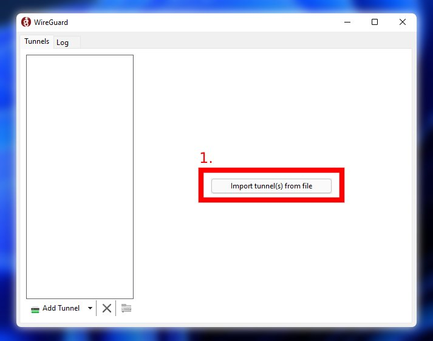
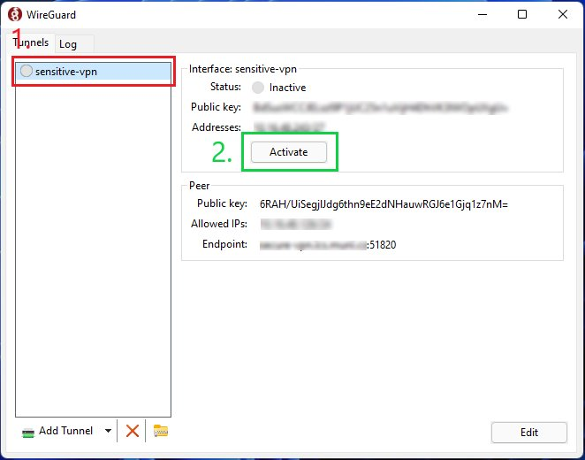
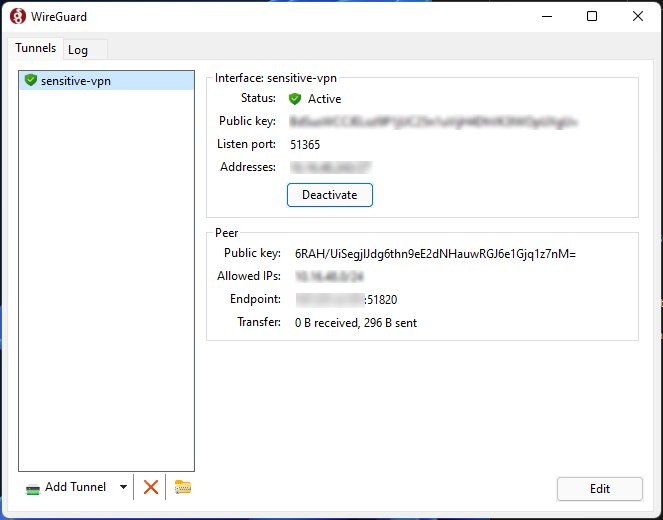

# VPN

Virtual Private Network (VPN) is used to connect to the secure environment that is **isloated from the Internet**. The CERIT-SC VPN solution is based on [WireGuard](https://www.wireguard.com/) software.   

To use the VPN you will need to request access and configuration, please refer to the next section.

## Obtaining Access to VPN

If you are interested in using the VPN to connect to secured network and resources isolated from public network, please contact us at `trusted(at)e-infra.cz`.

## Connecting to VPN

Tutorials will show how to setup **WireGuard** with the configuration you have otained from CERIT-SC Team.

=== "Windows"

      1. Install WireGuard, download Windows installer [here](https://www.wireguard.com/install/)
      2. Create configuration file `sensitive-vpn.conf` in your personal, safe directory, e.g., `C:\Users\<username>\Documents\sensitive-vpn.conf` with content that you obtained from our team. Example of configuration file:

      ```
      [Interface]
      PrivateKey = DESKTOP_CLIENT_PRIVATE_KEY
      Address = 10.0.0.2/24

      [Peer]
      PublicKey = SERVER_PUBLIC_KEY
      Endpoint = SERVER_IP_ADDRESS:PORT
      AllowedIPs = 0.0.0.0/0
      ```
      3. Run `WireGuard` application.   
      4. In the `WireGuard` application, choose `Import tunnel(s) from file` and select the `sensitive-vpn.conf` stored in the 2nd step.   
         
      5. In order to activate the tunnel `(1) Select the tunnel you want to activate` and `(2) Activate the tunnel`
         
      6. Tunnel is activated, to disable tunnel use `Deactivate` button.
         

=== "Linux"

      1. Install WireGuard, download for Linux [here](https://www.wireguard.com/install/)
      2. Create configuration file `/etc/wireguard/wg0.conf` with content that you obtained from our team.   
      Example:

      ```
      [Interface]
      PrivateKey = DESKTOP_CLIENT_PRIVATE_KEY
      Address = 10.0.0.2/24

      [Peer]
      PublicKey = SERVER_PUBLIC_KEY
      Endpoint = SERVER_IP_ADDRESS:PORT
      AllowedIPs = 0.0.0.0/0
      ```
      3. In order to activate the tunnel, enter into `terminal` and use following command:
         
      ```
      wg-quick up wg0
      ```
      4. To check tunnel stats (if tunnel is active) use:
      ```
      wg-quick show
      ```
      5. To deactivate the tunnel use:
      ```
      wg-quick down wg0
      ```

=== "Mac OS"

      1. Install WireGuard, download for Mac OS [from the Apple App Store](https://apps.apple.com/us/app/wireguard/id1451685025?ls=1&mt=12)
      2. Create configuration file `sensitive-vpn.conf` in your personal, safe directory, e.g., `/home/<username>/sensitive-vpn.conf` with content that you obtained from our team. Example of configuration file:

      ```
      [Interface]
      PrivateKey = DESKTOP_CLIENT_PRIVATE_KEY
      Address = 10.0.0.2/24

      [Peer]
      PublicKey = SERVER_PUBLIC_KEY
      Endpoint = SERVER_IP_ADDRESS:PORT
      AllowedIPs = 0.0.0.0/0
      ```
      3. Run `WireGuard` application.   
      4. In the `WireGuard` application, choose `Import tunnel(s) from file` and select the `sensitive-vpn.conf` stored in the 2nd step.   
      5. In order to activate the tunnel `Select the tunnel you want to activate` and `Activate the tunnel`   
      6. Tunnel is activated, to disable tunnel use `Deactivate` button.
