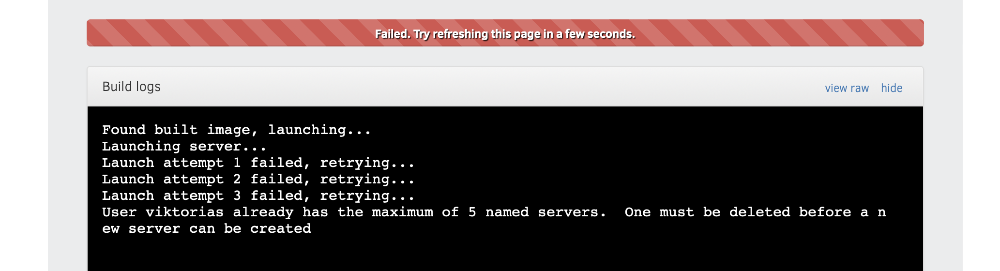
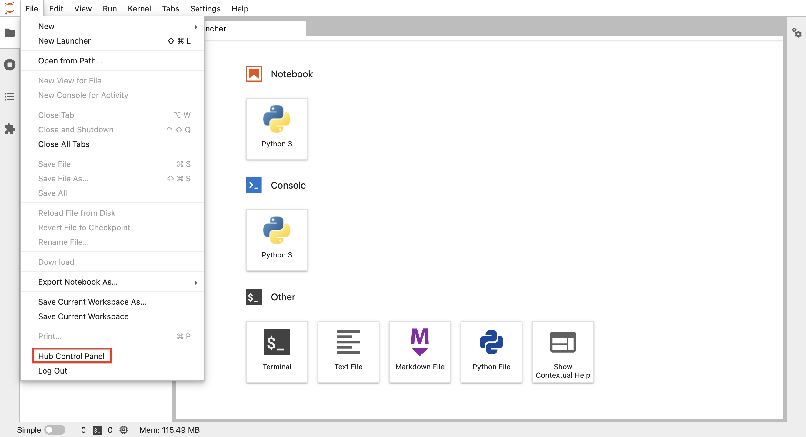
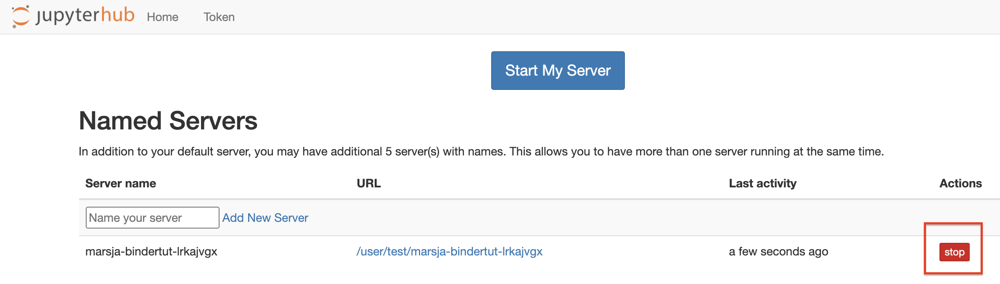
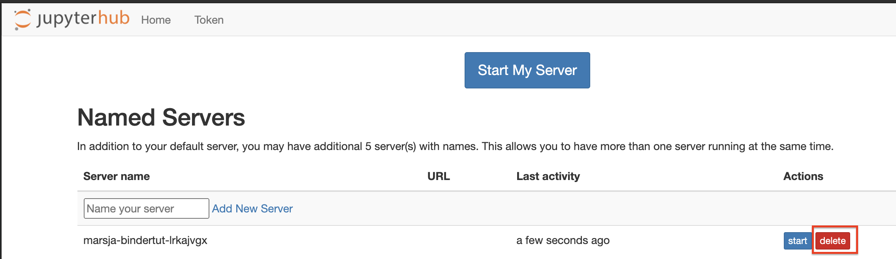

# BinderHub

BinderHub is a Binder instance working on Kubernetes located on [binderhub.cloud.e-infra.cz](https://binderhub.cloud.e-infra.cz/). Binder turns a Git repo into collection of interactive notebooks. It is enough to fill the git repository name (optionally specific notebook or branch) and binderhub will turn it into a web notebook. 

## Authentication
To use CERIT-SC BinderHub instance, you have to authenticate. Authentication is performed via unified login. 

## Persistence
After the notebook is spawned, a persistent volume is mounted to path `/home/{username}-nfs-pvc`. The same persistent volume is mounted to mentioned path in each notebook you spawned. Therefore, if you want to use data generated in BinderHub instance *A* in instance of BinderHub *B*, you can write the data to path `/home/{username}-nfs-pvc` and they will be available for use. 

Note: Pay attention to paths used in notebooks. Imagine you have two BinderHub running. In both, you write outputs to location `/home/{username}-nfs-pvc/test`. If both notebooks create file named `result.txt`, you would be overwriting the file. It is a good practice to create new directory in path `/home/{username}-nfs-pvc` for each BinderHub instance. 

## Resources
Each user on your JupyterHub can use certain amount of memory and CPU. You are guaranteed **1G of RAM** and **1 CPU**. Resource limits represent a hard limit on the resources available. There are **16G of RAM** and **8 CPU** limits placed which means you can't use more than 16G of RAM and 8 CPUs, no matter what other resources are being used on the machines. 

If you need more resources, please contact us at <a href="mailto:k8s@ics.muni.cz">IT Service desk</a>.

## Where to find running notebooks
Your running notebooks can be found at `https://bhub.cloud.e-infra.cz/`. Clicking on address redirects you to the notebook instance. Because redirection links include random strings it is advised to work in one browser where cookies can be stored and you don;t have to remember long notebook addresses. Also, avoid incognito windows because the session cookie won't save and when you close the tab, you will not find the instance in control panel. 

## Limits
Currently, every user is limited to spawn 5 projects. If you reach quota but you want to deploy new instance, an error will appear under loading bar of BinderHub index page.



To spawn new instance, you have to delete one of your running instances.  This can be done in JupyterHub control panel (JupyterHub is used underneath BinderHub). Navigate to `https://bhub.cloud.e-infra.cz/` and stop any instance you don't need. When red button `delete` appears, click on that one as well. After that, it should be possible to spawn new instance at [binderhub.cloud.e-infra.cz](https://binderhub.cloud.e-infra.cz/).







❗️<ins>Notebooks are deleted automatically after one week of inactivity (inactivity = idle kernel or no connection to notebook).</ins>❗️

## Custom Dockerfile

The hub spawns notebook instances with default image not conatining any special libraries. However, you can create custom `Dockerfile` with all dependencies and it will be used as base image. The `Dockerfile` must be located in the repository you are going to launch in Binder. 

When creating the `Dockerfile` bear in mind it has to be runnable under *user*. Furthermore, it is important to `chown` all used directories to user, e.g. :
```
RUN chown -R 1000:1000 /work /home/jovyan
```

