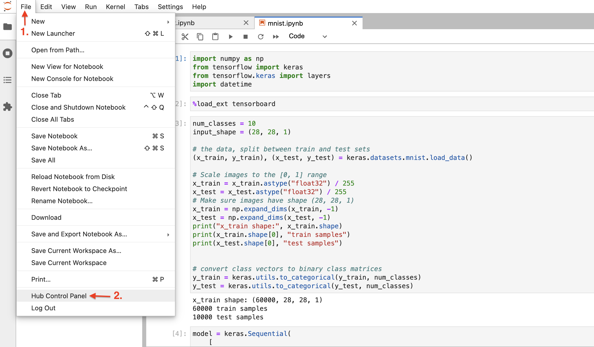
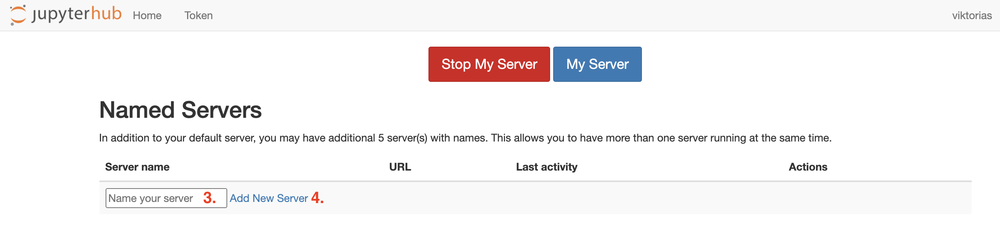
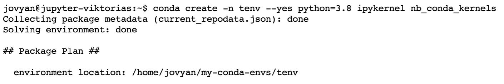
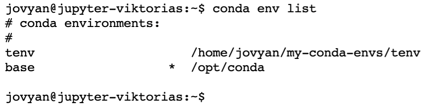
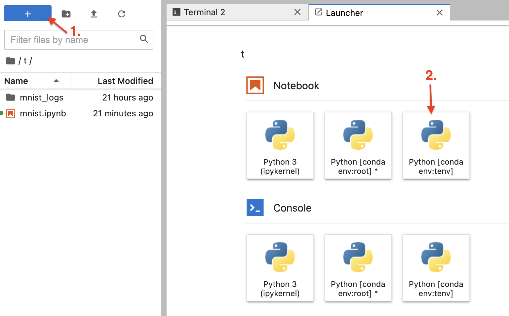

# JupyterHub 

We provide a JupyterHub running on Kubernetes for every MetaCentrum member. The hub can be accessed on [hub.cloud.e-infra.cz](https://hub.cloud.e-infra.cz/). Sign in with meta username (do not use @META, only username). 

## Choosing Image

Any Jupyter notebook image can be run, options already provided:
- minimal-notebook ([spec](https://jupyter-docker-stacks.readthedocs.io/en/latest/using/selecting.html#jupyter-minimal-notebook))
- datascience-notebook ([spec](https://jupyter-docker-stacks.readthedocs.io/en/latest/using/selecting.html#jupyter-datascience-notebook))
- scipy-notebook ([spec](https://jupyter-docker-stacks.readthedocs.io/en/latest/using/selecting.html#jupyter-scipy-notebook))
- tensorflow-notebook ([spec](https://jupyter-docker-stacks.readthedocs.io/en/latest/using/selecting.html#jupyter-tensorflow-notebook))
- tensorflow-notebook with GPU support ([spec](https://jupyter-docker-stacks.readthedocs.io/en/latest/using/selecting.html#jupyter-tensorflow-notebook) but TF v. 2.7.0 and TensorBoard installed)

If you choose custom, you have to provide image name together with its repo and optional tag - input text in format _repo/imagename:tag_.
`minimal-notebook` is chosen as default image.

## Choosing Storage

By default, every notebook runs with persistent storage mounted to `/home/jovyan`. Therefore, we recommend to save the data to `/home/jovyan` directory to have them accessible every time notebook is spawned. Same persistent storage is mounted to all your notebooks so you can share data across multiple instances. Furthermore, in case you delete all you JupyterHub notebook instances and spawn new one later, again same persistent storage is mounted. Therefore your data are preserved across instances and across spawns.

Optionally, you can mount your MetaCentrum home - check the option and select the desired home. Now, it is possible to mount only one home per notebook. In hub, your home is located in `/home/meta/{meta-username}`.

Possible homes:

brno10-ceitec-hsm | brno11-elixir | brno12-cerit | brno14-ceitec | vestec1-elixir
--- | --- | --- | --- |--- 
brno1-cerit | brno2 | brno3-cerit | brno6  | praha1
brno8 | brno9-ceitec | budejovice1 | du-cesnet | praha2-natur
liberec3-tul | ostrava1 | ostrava2-archive | pruhonice1-ibot | praha5-elixir
plzen1 | plzen4-ntis                   

## Resources

Each user on JupyterHub can use certain amount of memory and CPU. You are guaranteed **1G of RAM** and **1 CPU**. Resource limits represent a hard limit on the resources available. There are **256G of RAM** and **32 CPU** limits placed which means you can't use more than 256G of RAM and 32 CPUs for that specific instance.

It is possible to utilize GPU in your notebook. Using GPU requires particular setting (e.g. drivers, configuration) so it can be really used only in Tensorflow image with GPU support. You can request at most 2 whole GPUs. 

## Named Servers

In the top left corner, go to `File &rarr; Hub Control Panel`. Fill in the `Server name` and click on `Add new server`, you will be presented with input form page. 

## Conda Environment

Conda is supported in all provided images and we can assure its functionality. 

New conda environment in hub's terminal is created with command `conda create -n tenv --yes python=3.8 ipykernel nb_conda_kernels` (`ipykernel nb_conda_kernels` part is required, alternatively irkernel). 

Check if environment is installed with `conda env list`. You can use the environment right away, either by creating new notebook or changing the kernel of existing one (tab `Kernel` → `Change Kernel...` and choose the one you want to use).

## Install Conda Packages

To install conda packages you have to create new conda environment (as described above). Then, install new packages in terminal into newly created environment e.g. `conda install keyring -n myenv`. 

Open new notebook and change the kernel in tab `Kernel` → `Change Kernel...` → `myenv` (or the nemae of kernel you installed packages into).

## Error Handling

You receive _HTTP 500:Internal Server Error_ when accessing the URL `/user/your_name`. Most likely, this error is caused by:

1. You chose MetaCentrum home you haven't used before - The red 500 Error is followed by `Error in Authenticator.pre_spawn_start`
2. You chose MetaCentrum home you don't have access to - The red 500 Error is followed by `Error in Authenticator.pre_spawn_start`
3. While spawning, `Error: ImagePullBackOff` appears

Solutions:

1. Log out and log in back
2. You can not access the home even after logging out and back in - you are not permitted to use this particular home
3. Clicking on small arrow `Event log` provides more information. Most certainly, a message tagged `[Warning]` is somewhere among all of them and it provides more description. It is highly possible the repo and/or image name is misspelled. 
 - please wait for 10 minutes
 - The service has a timeout of 10 minutes and during this time, it is trying to create all necessary resources. Due to error, creation won't succeed and after 10 minutes you will see red progress bars with message `Spawn failed: pod/jupyter-[username] did not start in 600 seconds!`. At this point, it is sufficient to reload the page and click on `Relaunch server`.

## I've Chosen Wrong Home! What Now?

If notebook is already running, in the top left corner, go to `File ` &rarr; `Hub Control Panel` and click red `Stop My Server`. In a couple of seconds, your container notebook instance will be deleted (stop button disapperas) and you can again `Start Server` with different home. 

Alternatively, you can create another named server. Fill in the `Server name` and click on `Add new server`, you will be presented with input form page. 

All of your named server are accessible under `Hub Control panel` where you can manipulate with them (create, delete, log in to).

## Feature Requests

Any tips for features or new notebook types are welcomed at <a href="mailto:k8s@ics.muni.cz">IT Service desk</a>.
